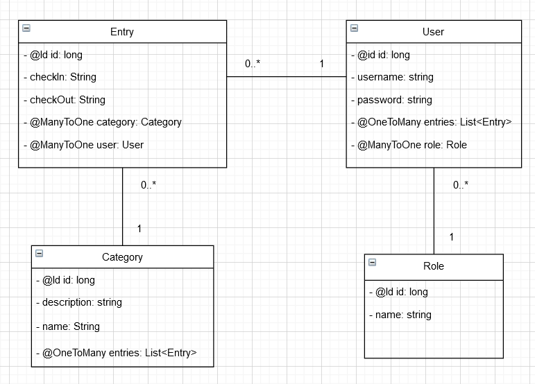

# M223: Punchclock
Dies ist eine Beispielapplikation für das Modul M223.

## Loslegen
Folgende Schritte befolgen um loszulegen:
1. Sicherstellen, dass JDK 12 installiert und in der Umgebungsvariable `path` definiert ist.
1. Ins Verzeichnis der Applikation wechseln und über die Kommandozeile mit `./gradlew bootRun` oder `./gradlew.bat bootRun` starten
1. Unittest mit `./gradlew test` oder `./gradlew.bat test` ausführen.
1. Ein ausführbares JAR kann mit `./gradlew bootJar` oder `./gradlew.bat bootJar` erstellt werden.

Folgende Dienste stehen während der Ausführung im Profil `dev` zur Verfügung:
- REST-Schnittstelle der Applikation: http://localhost:8081
- Dashboard der H2 Datenbank: http://localhost:8081/h2-console

Die Applikation kann Zeiteinträge verfassen, welche eine Kategorie besitzen.
Zudem gibt es verschiedenen Rollen(Benutzer, Admin). Der Benutzer kann nur seine eigenen Zeiteinträge verwalten (erstellen, bearbeiten, löschen und anzeigen).

## Beispieldaten
Beim Start der Applikation werden Beispieldaten in die H2 Datenbank geladen. 
Folgende Benutzer werden erstellt:
- Adminrolle
  - Benutzername: admin, Passwort: password
- Normale Rollen
  - Benutzername: testuser, Passwort: password
  - Benutzername: testuser1, Passwort: password
    
Jede Rolle die neue erstellt wird, hat automatisch die Adminrolle.

## Änderungen zur Planung
Die Entität Rolle ist im Fachklassendiagramm als Enum dargestellt.
Der Einfachheitshalber habe ich die Entität Rolle zuerst als normale gemacht.
Leider reichte die Zeit nicht mehr, es als Enum zu implementieren.
Im Bild sieht man, wie die Rolle nun aussieht.

